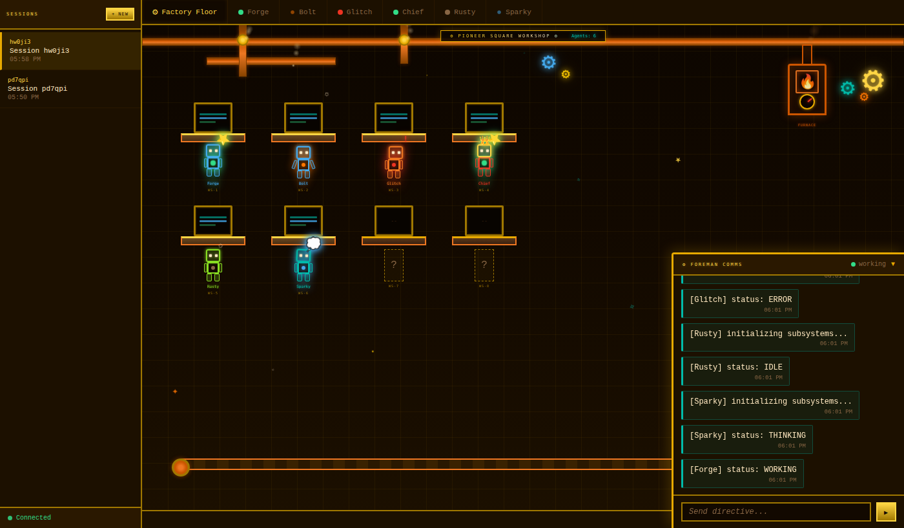

# Pioneer Square

A real-time multi-agent workspace with a colorful pixel-art factory floor UI.



## Features

- 🏭 Pixel-art steampunk factory floor with animated gears, steam, and furnaces
- 🤖 Agent avatars with state-based animations (idle/thinking/working/busy/error)
- 💬 Real-time chat with the Foreman agent
- 🖥️ Terminal log panes per agent
- 🔗 WebRTC peer connections for agent-to-agent communication
- 📡 WebSocket signaling for real-time updates
- 🔑 Short 6-char session URLs for sharing

## Setup

### Backend

```bash
cd backend
python -m venv venv
source venv/bin/activate  # Windows: venv\Scripts\activate
pip install -r requirements.txt
uvicorn main:app --reload --port 8000
```

### Frontend

```bash
cd frontend
npm install
npm run dev
```

Open http://localhost:5173 — a new session will be created automatically.

### Worker

Worker agents run as standalone processes (one per worker) and connect to the
backend over WebSocket. They can run on any machine that has `claude`, `git`,
and access to the configured repos.

```bash
cd worker
python -m venv venv
source venv/bin/activate
pip install -e .
cp pioneer-worker.toml.example pioneer-worker.toml
# edit pioneer-worker.toml: backend_url, session_id, repos, github token
pioneer-worker
```

See [`worker/README.md`](worker/README.md) for details.

## Architecture

- **Backend**: FastAPI + aiosqlite + WebSocket signaling
- **Frontend**: Vue 3 + Pinia + Vue Router + WebRTC
- **Worker**: Standalone Python process (`pioneer-worker` CLI) that runs
  Claude on assigned tasks and opens GitHub PRs.
- **Database**: SQLite (sessions, agents, messages, workers, tasks)

## Connecting Agents

Agents connect via WebSocket at `ws://localhost:8000/ws/{sessionId}` and send:

```json
{ "type": "join", "agentId": "agent-1", "agentName": "Builder", "agentType": "worker" }
{ "type": "agent-state", "agentId": "agent-1", "state": "working" }
{ "type": "terminal-output", "agentId": "agent-1", "line": "Building project..." }
```

States: `idle` | `thinking` | `working` | `busy` | `error`
